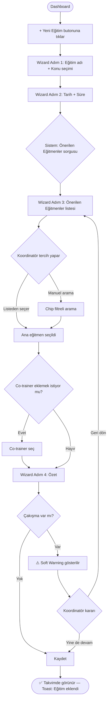
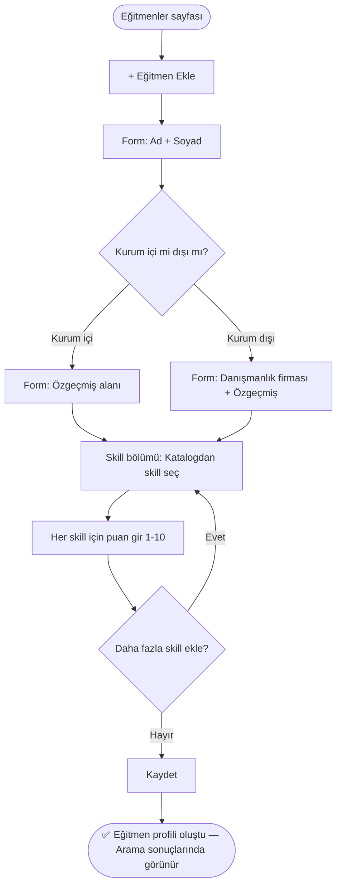
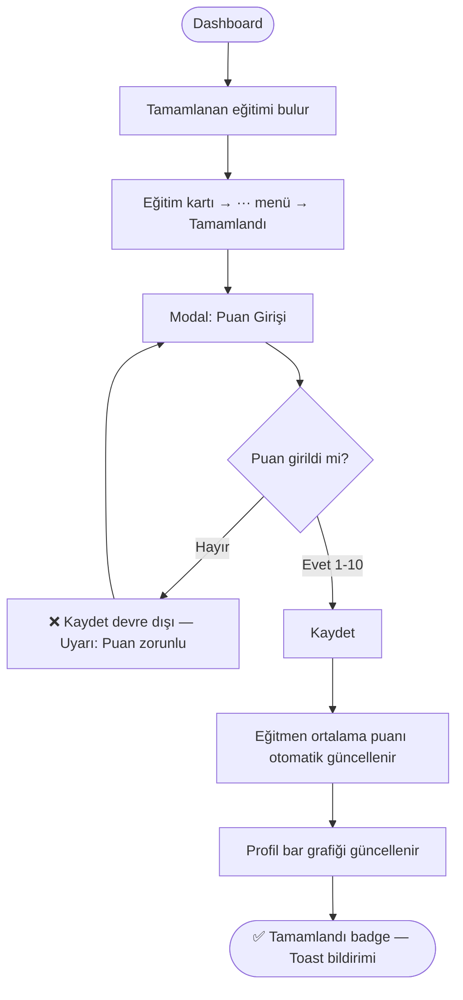
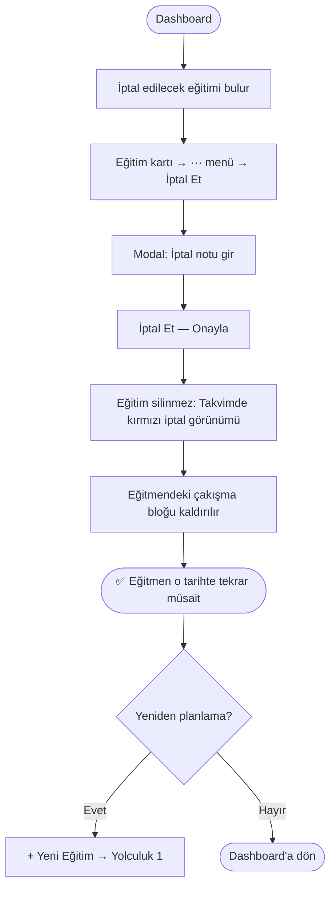

# UX Tasarım Spesifikasyonu - tagman

**Yazar:** ugerdem
**Tarih:** 2026-05-06

---

## Executive Summary

### Project Vision

Akademi Portalı, Eğitim Koordinatörü'nün her gün tekrar ettiği iş akışını —
eğitmen bul, müsaitliğini kontrol et, eğitime ata — dakikalar içinde ve
tek bir ekrandan tamamlamasını sağlayan kurumsal bir web uygulamasıdır.

100+ eğitmenlik bir havuzu Excel dosyaları ve e-posta yazışmalarıyla yönetmek
yerine koordinatör; chip filtrelerle saniyeler içinde doğru eğitmeni bulur,
profil bilgilerini ve takvim durumunu aynı anda görür, doğrudan atar.

### Target Users

**Birincil Kullanıcı: Eğitim Koordinatörü**

- Sistemi **her gün** aktif olarak kullanır
- 100+ eğitmenlik bir havuzu yönetir
- En kritik iş akışı: Doğru eğitmeni hızla bulmak ve eğitime atamak
- Masaüstü tarayıcı kullanır; mobil kapsam dışı
- Orta teknik yetkinlik; iş odaklı, verimlilik beklentisi yüksek
- Tek bir kuruma hizmet eder (multi-tenant gereksinimi yok)

**Koordinatörün Günlük Acısı:**
Eğitmeni filtrelemek, takvim doluluk durumunu elle kontrol etmek ve
sonra tekrar forma dönüp atamayı tamamlamak — bu kopuk akış en büyük
sürtünme noktasıdır.

### Key Design Challenges

1. **Hız Odaklı Filtreleme:** 100+ eğitmen havuzunda koordinatör doğru kişiyi
   saniyeler içinde bulabilmelidir. Chip filtreler anlık tepki vermeli, sayfa
   yenilenmemeli, sonuçlar gerçek zamanlı güncellenmelidir.

2. **Bağlamı Kırmadan Atama:** Koordinatör eğitmeni bulduğu andan atama
   tamamlandığı ana kadar farklı sayfalar arasında gezinmek zorunda kalmamalıdır.
   Wizard akışı, arama sonuçları ve takvim bilgisi tek bir bağlamda sunulmalıdır.

3. **Takvim ve Müsaitlik Görünürlüğü:** Çakışma kontrolü atama sırasında
   görünür ve anlaşılır olmalıdır; koordinatör önceden arama yapmak zorunda
   kalmamalıdır.

4. **Günlük Kullanım Yorgunluğu:** Her gün tekrar eden aynı akışlar (eğitim
   tanımla → eğitmen ara → ata) minimum tıklama ile tamamlanabilmelidir;
   form doluluğu ve sayfa geçişleri optimize edilmelidir.

### Design Opportunities

1. **"Tek Bakışta Karar" Eğitmen Kartı:** Arama sonucunda her kart;
   isim, ortalama puan, kurum içi/dışı durumu ve o günün müsaitlik
   göstergesini bir arada sunarsa koordinatör profile girmeden karar
   verebilir.

2. **Sıfır Sürtünmeli Önerilen Eğitmenler:** Wizard'da eğitim tarihi
   girildiği anda ilgili konudaki en yüksek puanlı ve müsait eğitmenler
   otomatik yüzeye çıkarsa koordinatör arama bile yapmak zorunda kalmaz.

3. **Takvim Odaklı Ana Sayfa:** Dashboard eğitimleri takvim/liste/kart
   seçeneğiyle sunarsa koordinatör günü planlarken bağlam değiştirmez;
   her şey tek yerden görünür.

4. **Koşullu Form Zekası:** Kurum dışı seçildiğinde danışmanlık firması
   alanının otomatik açılması gibi küçük ama akıllı form davranışları,
   günlük kullanımda birikimli zaman kazandırır.

### Design Constraints

- **Renk Sistemi:** Turkcell kurumsal marka renkleri kullanılacak
  - Birincil: Turkcell Sarısı (`#FFD100`)
  - İkincil / Vurgu: Turkcell Koyu Gri / Siyah (`#1A1A1A`)
  - Nötr yüzey renkleri beyaz ve açık gri tonları (`#F5F5F5`, `#FFFFFF`)
  - Durum renkleri: başarı yeşil, uyarı amber, hata kırmızı — Turkcell paletine uyumlu
- **Tema:** Yalnızca **Light Tema** — dark mode kapsam dışı

## User Journey Flows

### Yolculuk 1 — Eğitim Planlama ve Eğitmen Atama

**Senaryo:** Koordinatör yeni bir eğitim planlar ve en uygun eğitmeni atar.

### Yolculuk 2 — Yeni Eğitmen Tanımlama

**Senaryo:** Kuruma yeni bir eğitmen (kurum dışı) eklenir.

### Yolculuk 3 — Eğitim Tamamlama ve Puan Girişi

**Senaryo:** Tamamlanan eğitim işaretlenir, zorunlu puan girilir.

### Yolculuk 4 — Eğitim İptali ve Yeniden Planlama

**Senaryo:** Planlanan eğitmen hastalanır; eğitim iptal edilir, sonra yeniden planlanır.

### Journey Patterns

- **Giriş Noktası:** Her yolculuk Dashboard veya ilgili liste sayfasından başlar
- **Onay Örüntüsü:** Kritik işlemler modal içinde ikinci onay ister
- **Hata Kurtarma:** Tüm akışlarda "Geri / Vazgeç" her zaman görünür; veri kaybolmaz
- **Geri Bildirim:** Başarı → yeşil toast; hata → inline kırmızı mesaj + ne yapılacağı

### Flow Optimization Principles

1. Hiçbir kritik akış 4 adımı geçmez
2. Her modal ve wizard adımında çıkış butonu görünür
3. Sistem önerir, koordinatör onaylar — karar yükü azalır
4. Veri asla silinmez (soft delete); koordinatör içi rahat hisseder

## Responsive Design & Accessibility

### Responsive Strategy

**Kapsam: Yalnızca Masaüstü** — Mobil ve tablet kapsam dışı.

| Platform | Destek |
|---------|--------|
| Masaüstü (1024px+) | ✅ Tam destek |
| Tablet | ❌ Kapsam dışı |
| Mobil | ❌ Kapsam dışı |

### Breakpoint Strategy

Tek breakpoint: **1024px minimum genişlik**

- İçerik max-width: 1200px, ortalanmış
- Sidebar: 240px sabit
- İçerik: kalan genişlik (min 784px)
- 1280px+: istatistik kartları 4 kolon; 1024–1279px: 2 kolon
- Tailwind: yalnızca `lg:` ve `xl:` prefix — `sm:` / `md:` kullanılmaz

### Accessibility Strategy

**Hedef:** WCAG 2.1 Level AA (pratik subset)

| Gereksinim | Uygulama |
|-----------|---------|
| Renk Kontrastı | `#FFD100` / `#1A1A1A` → 10.6:1 ✅ |
| Klavye Navigasyonu | Tüm interaktif öğeler Tab ile erişilebilir |
| Focus Ring | `#FFD100` 2px outline |
| Anlamlı Etiketler | `<label>` + `aria-label` zorunlu |
| Durum Bildirimi | Renk + ikon + metin üçlüsü |
| Semantik HTML | `<nav>`, `<main>`, `<button>`, `<table>` doğru kullanım |

### Testing Strategy

- **Tarayıcı:** Chrome birincil; Firefox, Edge, Safari son sprint'te
- **Erişilebilirlik:** `axe-core` + klavye navigasyon testi
- **Performans:** Lighthouse 85+; arama < 1 sn, önerilen eğitmenler < 1.5 sn

### Implementation Guidelines

- `<button>` ve `<a>` etiketleri — `
` kullanılmaz
- `forwardRef` tüm custom form bileşenlerinde
- `useId()` ile benzersiz `id`–`htmlFor` eşleştirmesi
- `aria-live="polite"` toast ve anlık sonuç bölgelerinde
- Animasyon: yalnızca `transition-colors`, `transition-shadow`

## UX Consistency Patterns

### Button Hierarchy

| Seviye | Varyant | Renk | Kullanım | Kural |
|--------|---------|------|---------|-------|
| Birincil | `primary` | `#FFD100` / `#1A1A1A` | Sayfada tek ana aksiyon | Max 1 primary / sayfa |
| İkincil | `outline` | Beyaz / `#E5E5E5` | Destekleyici aksiyonlar | Primary yanında |
| Yıkıcı | `destructive` | Kırmızı outline | İptal, pasife al | Modal içinde, onay gerektirir |
| Ghost | `ghost` | Şeffaf | ··· menü, geri butonu | Görsel ağırlık gerekmiyorsa |

### Feedback Patterns

| Tür | Bileşen | Renk | Süre | Örnek |
|-----|---------|------|------|-------|
| Başarı | Toast (sağ alt) | Yeşil | 3 sn, oto kapanır | "Eğitim takvime eklendi" |
| Hata | Inline (alan altı) | Kırmızı | Kalıcı | "Puan zorunludur" |
| Uyarı | Banner / Dialog | Sarı | Kullanıcı kapatır | Çakışma uyarısı |
| Bilgi | Muted metin | Gri | Kalıcı | Form açıklama metni |

### Form Patterns

- Her input'un üzerinde görünür `<label>` — placeholder tek başına kullanılmaz
- Validasyon `onBlur` ile çalışır — submit'te değil
- Zorunlu alanlar kırmızı `*` ile işaretlenir; form başında not
- Koşullu alanlar `animated expand` ile açılır (kurum dışı → firma alanı)
- Kaydet butonu: zorunlu alanlar tamamlanmadan `disabled`

### Navigation Patterns

- Aktif sayfa: sol 3px sarı border + `#252525` arka plan
- Wizard: adım numaraları + bağlantı çizgisi; tamamlananlar yeşil ✓
- "‹ Geri" her wizard adımında, "Vazgeç" her modalde görünür
- Breadcrumb yok — tek seviyeli navigasyon

### Empty States

Her boş durum: **Ne yok → Neden → Ne yapılabilir**

| Ekran | Mesaj | CTA |
|-------|-------|-----|
| Eğitmen arama (filtre) | "Bu kriterlere uyan eğitmen bulunamadı." | Filtreleri Temizle |
| Eğitmen arama (genel) | "Henüz eğitmen eklenmemiş." | + Eğitmen Ekle |
| Dashboard | "Bu haftaya ait eğitim planlanmamış." | + Yeni Eğitim |
| Önerilen eğitmenler | "Uygun eğitmen bulunamadı." | Tüm Eğitmenlerde Ara |

### Loading States

- Liste/tablo: shadcn/ui `Skeleton` — içerik şekli korunur
- Önerilen eğitmenler: 3 kart boyutunda skeleton satırı
- Uzun işlem (> 1 sn): primary buton disabled + spinner

### Search & Filter Patterns

- Metin: `onChange` + 300ms debounce
- Chip: ekle/çıkar sonucu anlık günceller
- Sonuç sayısı: filtre çubuğu altında — "14 eğitmen bulundu"
- CSV export: mevcut filtre sonucunu indirir

## Component Strategy

### Design System Components (shadcn/ui — Hazır)

| Bileşen | Kullanım |
|---------|---------|
| `Button` | CTA, outline, ghost varyantları |
| `Dialog` | Tamamlama, iptal notu, çakışma uyarısı |
| `Input / Textarea` | Form alanları |
| `Select` | Süre, konu seçimi |
| `Badge` | Durum etiketleri |
| `Table` | Skill kataloğu, liste görünümü |
| `Toast` | Başarı / hata bildirimleri |
| `Avatar` | Eğitmen avatarları |
| `Dropdown Menu` | ··· aksiyon menüsü |

### Custom Components

| Bileşen | Amaç | Faz |
|---------|------|-----|
| `TrainerCard` | Arama sonucu kartı — tek bakışta karar | 1 |
| `ChipFilterBar` | Anlık çok kriterli filtreleme | 1 |
| `SuggestedTrainersPanel` | Wizard'da proaktif eğitmen önerisi | 1 |
| `ConflictWarningDialog` | Soft warning — engelleme yapmaz | 1 |
| `ScoreInputWidget` | 1-10 puan girişi (numara butonları) | 2 |
| `TrainerProfileHeader` | Profil sayfası üst özet | 2 |
| `AnnualBarChart` | Recharts ile yıllık eğitim bar grafiği | 2 |
| `StatusBadge` | Durum + ikon + renk üçlüsü | 3 |

### Component Implementation Strategy

- Tüm custom bileşenler shadcn/ui token sistemi üzerine inşa edilir
- `cn()` utility ile koşullu class birleştirme
- `forwardRef` pattern, `aria-*` attribute'ları zorunlu
- Dosya yapısı: `components/ui/trainer-card.tsx`

### Implementation Roadmap

- **Faz 1 (Sprint 1-2):** TrainerCard, ChipFilterBar, SuggestedTrainersPanel, ConflictWarningDialog
- **Faz 2 (Sprint 3):** ScoreInputWidget, TrainerProfileHeader, AnnualBarChart
- **Faz 3 (Sprint 4):** StatusBadge, skeleton/loading states, empty states

## Visual Design Foundation

### Color System

**Marka Renkleri (Turkcell)**

| Token | Değer | Kullanım |
|-------|-------|---------|
| `primary` | `#FFD100` | CTA butonları, aktif chip, sidebar aktif gösterge |
| `primary-foreground` | `#1A1A1A` | Primary buton üzeri metin |
| `background` | `#F5F5F5` | Sayfa arka planı |
| `surface` | `#FFFFFF` | Kart, panel, modal yüzeyi |
| `sidebar-bg` | `#1A1A1A` | Sol navigasyon arka planı |
| `sidebar-text` | `#FFFFFF` | Sidebar metin ve ikonlar |
| `sidebar-active` | `#FFD100` | Aktif sayfa sol kenarlık göstergesi |
| `border` | `#E5E5E5` | Kart kenarlıkları, ayraçlar |
| `muted` | `#737373` | İkincil metin, placeholder |
| `success` | `#22C55E` | Müsaitlik, tamamlandı durumu |
| `warning` | `#F59E0B` | Çakışma uyarısı, soft warning |
| `destructive` | `#EF4444` | İptal durumu, hata mesajı |

**Renk Kullanım Kuralları:**
- Turkcell sarısı yalnızca aksiyon noktalarında — genel arka plan veya büyük yüzeylerde kullanılmaz
- Sidebar koyu zemin üzerinde sarı vurgu; içerik alanı açık zemin üzerinde koyu metin
- Durum renkleri (yeşil/sarı/kırmızı) yalnızca badge, etiket ve uyarı bileşenlerinde

### Typography System

**Font:** Inter (Google Fonts — ücretsiz, system-ui fallback)

**Tür Skalası:**

| Rol | Boyut | Ağırlık | Kullanım |
|-----|-------|---------|---------|
| `heading-1` | 24px | 700 | Sayfa başlıkları |
| `heading-2` | 20px | 600 | Bölüm başlıkları, kart başlıkları |
| `heading-3` | 16px | 600 | Alt bölümler, form grup başlıkları |
| `body` | 14px | 400 | Genel içerik, form etiketleri |
| `body-sm` | 13px | 400 | İkincil bilgi, açıklama metni |
| `caption` | 12px | 400 | Badge, etiket, meta bilgi |
| `label` | 14px | 500 | Buton metni, chip etiketi |

**Satır Yüksekliği:** 1.5 | **Köşe Yarıçapı:** 8px

### Spacing & Layout Foundation

**Temel Birim:** 4px (Tailwind spacing skalası)

**Düzen Yapısı:**
- Sol sidebar: 240px sabit, `#1A1A1A` arka plan
- İçerik alanı: Geri kalan genişlik, `#F5F5F5` arka plan
- İçerik max-width: 1200px, ortalanmış
- Sayfa padding: 24px yatay + dikey

**Sık Kullanılan Boşluklar:** 4 / 8 / 12 / 16 / 24 / 32px

### Accessibility Considerations

- WCAG AA kontrast: Sarı (#FFD100) + koyu (#1A1A1A) → 10.6:1 ✅
- Form elemanlarında gerçek `label` zorunlu (placeholder değil)
- Hata/uyarı: renk + ikon + metin üçlüsü
- Focus ring: `#FFD100` 2px outline (klavye navigasyonu)

## Defining Experience

### 2.1 Defining Experience

tagman'ın tanımlayıcı deneyimi:
**"Eğitim tanımla — sistem doğru eğitmeni bulsun — tek tıkla ata."**

Wizard'ın son adımında koordinatör konu ve tarihi girer, sistem ilgili konuda en yüksek puanlı ve o gün müsait eğitmenleri otomatik olarak sıralar. Koordinatör listeye bakar, seçer, kaydeder.

### 2.2 User Mental Model

**Mevcut Mental Model (Excel dönemi):**
1. Eğitmen listesi Excel'i aç
2. Konu sütununu filtrele
3. Puanları elle karşılaştır
4. Takvim Excel'ini aç, çakışma var mı kontrol et
5. E-posta at, onay bekle
6. Eğitim planlamasını başka bir dosyaya kaydet

**Yeni Mental Model (tagman):**
1. "Yeni Eğitim" → Konu + Tarih + Süre gir
2. Sistem önerir → Seç → Kaydet

**Kafa Karışıklığı Riski:**
- "Önerilen eğitmen" ile "tüm eğitmen arama" arasındaki fark net olmalı
- Çakışma uyarısı panik yaratmamalı; yumuşak ve açıklayıcı olmalı

### 2.3 Success Criteria

- Konu + tarih girişinden önerilen eğitmenler listesine geçiş < 1.5 sn
- Koordinatör wizard'ı tamamlamak için sayfayı terk etmek zorunda kalmaz
- Atama onaylandıktan sonra takvimde anında görünür
- Çakışma varsa uyarı metni ne yapılacağını söyler
- İlk kullanımda bile nasıl kullanılacağı eğitim gerektirmez

### 2.4 Novel UX Patterns

**Yerleşik Örüntüler:** Çok adımlı wizard, kart listesinden seçim, chip filtre çubuğu

**Yenilikçi Twist:** Proaktif Öneri — wizard'ın son adımında kullanıcı aramadan önce sistem en iyi eşleşmeleri yüzeye çıkarır. Standart "ara ve bul" kalıbını "sistem senin için bulur, sen onaylar" kalıbına dönüştürür.

### 2.5 Experience Mechanics

**1. Başlatma**
- "Yeni Eğitim Ekle" butonu (header veya dashboard CTA)
- Takvimde boş bir güne tıklama → wizard o tarihe kilitli açılır

**2. Etkileşim (Wizard Adımları)**
- Adım 1: Eğitim adı + konu (katalogdan seçim)
- Adım 2: Tarih + süre
- Adım 3: "Önerilen Eğitmenler" — puan sıralamalı kart listesi (isim, ortalama puan, kurum içi/dışı etiketi, müsaitlik göstergesi)
- İsteğe bağlı: Co-trainer ekle
- Adım 4: Özet + Kaydet

**3. Geri Bildirim**
- Her adımda inline validasyon
- Önerilen eğitmen kartında yeşil "Müsait" / sarı "Dikkat: Çakışma var" etiketi
- Kaydet sonrası: yeşil toast bildirimi "Eğitim takvime eklendi"

**4. Tamamlanma**
- Takvimde yeni eğitim kartı anında görünür
- Wizard kapanır, koordinatör takvim görünümüne döner
- Eğitmenin profil sayfasındaki takvimi otomatik güncellenir

## Core User Experience

### Defining Experience

tagman'ın temel deneyimi tek bir eylem döngüsüne odaklanır:
**Eğitim tanımla → Doğru eğitmeni bul → Ata.**

Bu döngü her gün tekrar eder. Tasarımın tüm kararları bu döngüyü
mümkün olduğunca az adımda, minimum bilişsel yük ile tamamlatmaya hizmet eder.

### Platform Strategy

- **Platform:** Yalnızca masaüstü tarayıcı (Chrome, Firefox, Edge, Safari)
- **Etkileşim Modeli:** Mouse + klavye; dokunmatik ekran kapsam dışı
- **SPA Davranışı:** Sayfa geçişleri tam yenileme olmadan gerçekleşir; koordinatör bağlamını kaybetmez
- **Offline:** Gereksinim yok
- **Responsive:** Yalnızca masaüstü breakpoint; mobil optimizasyon kapsam dışı

### Effortless Interactions

Aşağıdaki etkileşimler koordinatör için sıfır sürtünmeli olmalıdır:

1. **Chip Filtreli Arama:** Filtre ekleme/çıkarma anlık sonuç günceller; sayfa yenilenmez, bekleme süresi hissedilmez
2. **Önerilen Eğitmenler:** Wizard'da konu + tarih girildiği anda sistem uygun eğitmenleri sıralar; koordinatör arama ekranına geçmek zorunda kalmaz
3. **Koşullu Form Alanları:** "Kurum dışı" seçildiğinde danışmanlık firması alanı otomatik açılır; gereksiz alan görünmez
4. **Puan Güncelleme:** Eğitim tamamlandığında eğitmenin ortalama puanı otomatik hesaplanır; koordinatör ayrıca işlem yapmaz

### Critical Success Moments

1. **"Önerilen Eğitmenler" Anı:** Wizard'ın son adımında konu + tarihe göre en uygun eğitmenler sıralanmış gelir. Koordinatör listeden birini seçip kaydeder — bu, sistemin Excel'e karşı en güçlü kanıtıdır.
2. **Çakışma Soft Warning:** Dolu bir eğitmen seçildiğinde sistem kırmızı blok değil, sarı uyarı gösterir. Koordinatör bilgilendirilir ama atama engellenmez; karar koordinatöre bırakılır.
3. **Tamamlama Akışı:** "Tamamlandı" işaretlenir → puan zorunlu girilir → profil otomatik güncellenir. Koordinatör hiçbir adımı atlayamaz ama akış doğal hissettirmelidir.

### Experience Principles

1. **Bağlam Kırılmaz:** Koordinatör bir işi yaparken başka sayfaya taşınmak zorunda kalmamalıdır; wizard, arama ve takvim tek akış içinde çalışır.
2. **Sistem Önce Önerir, Sonra Sorar:** Koordinatör aktif arama yapmadan önce sistem en iyi seçeneği yüzeye çıkarır.
3. **Uyarı Bilgilendirir, Engellemez:** Çakışma ve eksik veri durumlarında sistem koordinatörü uyarır; son kararı kullanıcıya bırakır.
4. **Turkcell Kimliği ile Kurumsal Güven:** Sarı ve gri ton ağırlıklı, yalnızca light temada tutarlı bir kurumsal görünüm; koordinatör her gün bu arayüzde çalışırken tanıdıklık ve güven hisseder.

## Desired Emotional Response

### Primary Emotional Goals

tagman koordinatörde dört temel duyguyu eş zamanlı uyandırmalıdır:

1. **Verimli ve Kontrolde** — "Ne aradığımı saniyeler içinde buluyorum, süreci ben yönetiyorum."
2. **Güvenli ve Güvenilir** — "Sisteme girdiğim veri doğru kalıyor, çakışma varsa sistem beni uyarıyor, hata yapmıyorum."
3. **Rahatlamış** — "Excel kaosunu, birden fazla dosyayı ve manuel takibi artık düşünmüyorum. Kafam bu işe değil, işin içeriğine odaklanıyor."
4. **Profesyonel** — "Bu sistemi kullanmak kurumun eğitim süreçlerini ciddiye aldığını gösteriyor."

### Emotional Journey Mapping

| Aşama | İstenen His | Tasarım Tetikleyicisi |
|-------|-------------|----------------------|
| İlk açılış / Dashboard | Yönelmiş, hazır | Bu haftaki eğitimler öne çıkar; ne yapacağı bellidir |
| Eğitmen arama | Hızlı, kontrolde | Chip filtreler anlık çalışır; sonuç listesi hemen güncellenir |
| Önerilen eğitmenler görüldüğünde | "İşte bu!" anı | Sistem doğru kişiyi zaten öne çıkarmıştır |
| Atama tamamlandığında | Başarı, rahatlama | Kısa bir onay bildirimi; takvimde görünür |
| Çakışma uyarısı geldiğinde | Bilgilendirilmiş, endişesiz | Sarı uyarı; engelleme yok, karar koordinatörde |
| Bir şeyler ters gittiğinde | Güvende, yönlendirilmiş | Net hata mesajı; ne yapacağı açıkça söylenir |
| Her gün tekrar döndüğünde | Tanıdık, güvenilir | Arayüz değişmez; öğrenme eğrisi sıfırdır |

### Micro-Emotions

- **Güven > Şüphe:** Sistem tutarlı çalışır; koordinatör verilerin doğru kaydedildiğinden emin olur
- **Başarı > Hayal Kırıklığı:** Her tamamlanan atama küçük bir tatmin hissi bırakır
- **Netlik > Karmaşa:** Hangi alanda ne yapabileceği her ekranda bellidir
- **Kontrol > Çaresizlik:** Sistem koordinatörün kararlarını destekler, onun yerine karar vermez

### Design Implications

| Duygu | Tasarım Yaklaşımı |
|-------|------------------|
| Verimlilik | Chip filtreler, klavye kısayolları, minimum form adımı |
| Güvenilirlik | Inline validasyon, onay bildirimleri, soft delete (veri kaybolmaz) |
| Rahatlama | Temiz beyaz yüzey, Turkcell sarısı sadece aksiyon noktalarında |
| Profesyonellik | Tutarlı tipografi, kurumsal renk paleti, gereksiz animasyon yok |

### Emotional Design Principles

1. **Sessiz Güven:** Sistem arka planda doğru çalışır; koordinatör bunu hisseder ama düşünmek zorunda kalmaz.
2. **Küçük Zaferler:** Her başarılı atama ve tamamlama akışı kısa ama net bir onay sinyali verir.
3. **Sıfır Sürpriz:** Arayüz her gün aynı şekilde davranır; koordinatör neyin nerede olduğunu öğrenmek zorunda kalmaz.
4. **Turkcell Rengi = Aksiyon Noktası:** Sarı yalnızca tıklanabilir veya dikkat gerektiren yerlerde kullanılır; görsel gürültü yaratmaz.

## UX Pattern Analysis & Inspiration

### Inspiring Products Analysis

**Google Calendar**
- **Güçlü yönü:** Takvim/hafta/gün/gündem görünümleri arasında geçiş kesintisiz hissettiriyor; kullanıcı bağlamını kaybetmiyor
- **Aktarılabilir:** Takvim/Liste/Kart görünüm geçişi aynı sadelikte çalışmalı; seçilen görünüm oturum boyunca hatırlanmalı
- **Aktarılabilir:** Renk kodlaması — planlandı (mavi), tamamlandı (yeşil), iptal (kırmızı/gri) — Google Calendar kullanıcısı bu dili zaten biliyor
- **Aktarılabilir:** Takvimde bir güne tıklayınca hızlı eğitim oluşturma tetiklenebilir; wizard o noktadan başlar

**Linear**
- **Güçlü yönü:** Anlık filtreler, sıfır bekleme süresi, yoğun ama düzensiz değil bilgi düzeni; her şey hızlı hissettiriyor
- **Aktarılabilir:** Chip filtreler Linear'ın filter bar mantığıyla çalışmalı — filtre ekle/çıkar, liste anında güncellenir
- **Aktarılabilir:** Sol kenar çubuğu navigasyon; hangi sayfada olduğun her zaman bellidir, aktif sayfa vurgulanır
- **Aktarılabilir:** Durum geçişleri (Planlandı → Tamamlandı / İptal) Linear'ın status chip mantığıyla görselleştirilebilir

**LinkedIn**
- **Güçlü yönü:** Profil kartı tek bakışta karar verdiriyor — isim, unvan, bağlantı sayısı hemen görünür
- **Aktarılabilir:** Eğitmen arama sonuç kartı aynı mantıkla: isim, ortalama puan, kurum içi/dışı etiketi, o günün müsaitlik göstergesi — profile girmeden karar verilebilir
- **Aktarılabilir:** Skill listesi ikincil görünüm olarak kartın altında açılabilir (LinkedIn'in "show more skills" davranışı)

### Transferable UX Patterns

**Navigasyon Örüntüleri**
- Sol kenar çubuğu + içerik alanı (Linear) — Dashboard, Eğitmenler, Skill Kataloğu, Ayarlar için ana navigasyon
- Görünüm sekmesi geçişi (Google Calendar) — Takvim / Liste / Kart

**Etkileşim Örüntüleri**
- Chip filtre çubuğu (Linear) — eğitmen aramada anlık filtreleme
- Takvimde tıkla-oluştur (Google Calendar) — hızlı eğitim ekleme
- Kart ikincil görünümü (LinkedIn) — skill detayı toggle

**Görsel Örüntüler**
- Beyaz yüzey + açık gri ikincil alan (Linear / Google) — Turkcell sarısı yalnızca CTA ve aktif durum için
- Renk kodlu durum etiketleri (Google Calendar) — eğitim durumu takvimde ve liste görünümünde tutarlı

### Anti-Patterns to Avoid

- **LinkedIn bilgi yoğunluğu:** Profil sayfasında her şeyi gösterme isteği — eğitmen profilinde önce özet, detay ikincil katmanda
- **Google Calendar'ın tekrarlayan etkinlik karmaşıklığı:** Tagman'da tekrarlayan eğitim yok; o karmaşıklık gereksiz
- **Modal üstüne modal:** Wizard zaten bir akış; üzerine ikinci modal açmak koordinatörü bağlamdan koparır
- **Boş durum sessizliği:** Filtre sonucu boş geldiğinde neden boş olduğu ve ne yapılabileceği açıkça söylenmeli

### Design Inspiration Strategy

**Doğrudan Alınacak:**
- Linear chip filtre çubuğu → Eğitmen arama
- Google Calendar renk kodlaması → Eğitim durum gösterimi
- Sol sidebar navigasyon → Tüm uygulama navigasyonu

**Adapte Edilecek:**
- LinkedIn profil kartı → Eğitmen sonuç kartı (LinkedIn'den daha az bilgi, müsaitlik göstergesi eklendi)
- Google Calendar tıkla-oluştur → Wizard tetikleyici (sadece tarih seçimi, tam eğitim wizard'ı açılır)

**Kaçınılacak:**
- Karmaşık modal katmanlaması
- Bilgi aşırı yüklemesi (LinkedIn tuzağı)
- Gereksiz animasyon (Linear sadeliğini koru)

## Design Direction Decision

### Design Directions Explored

6 ekran senaryosu HTML mockup olarak üretildi ve incelendi:
1. Dashboard (Takvim + Liste görünümü)
2. Eğitmen Arama (Chip filtreler + kart listesi + skill toggle)
3. Eğitim Wizard (Adım 2: Tarih/Süre + Adım 3: Önerilen Eğitmenler)
4. Eğitmen Profil (Bar grafik + skill puanları + eğitim geçmişi)
5. Tamamlama Akışı (Puan girişi modal + çakışma soft warning)
6. Skill Kataloğu (Tablo yönetimi)

### Chosen Direction

**Onaylanan Yön:** Tüm ekranlar onaylandı — tek tutarlı tasarım dili.

- Koyu sidebar (`#1A1A1A`) + açık içerik alanı (`#F5F5F5`)
- Turkcell sarısı (`#FFD100`) yalnızca CTA, aktif chip ve sidebar aktif göstergede
- Dengeli bilgi yoğunluğu — Linear sadeliği, kurumsal ciddiyet
- 8px border radius, Inter font, shadcn/ui bileşen seti

### Design Rationale

- Linear'dan alınan chip filtre + sol sidebar navigasyon kullanıcı beklentisine uygun
- Google Calendar renk kodlaması (mavi=planlandı, yeşil=tamamlandı, kırmızı=iptal) sezgisel
- LinkedIn kart yapısı eğitmen seçim kararını tek bakışta destekliyor
- Önerilen Eğitmenler bölümü sarı vurgu ile sayfada hiyerarşik üstünlük taşıyor

### Implementation Approach

- shadcn/ui bileşenlerini Tailwind config token'larıyla tema at
- Sidebar sabit, içerik alanı scroll edilebilir
- Wizard: shadcn/ui Dialog veya tam sayfa route ile; modal üstüne modal yok
- Tablo: shadcn/ui Table + TanStack Table (sıralama, filtreleme)
- Bar grafik: Recharts (basit, hafif, Tailwind uyumlu)

## Design System Foundation

### Design System Choice

**shadcn/ui + Tailwind CSS**

### Rationale for Selection

- Next.js App Router ile tam uyumlu; aynı teknik yığın içinde çalışır
- Tailwind CSS zaten kurulu — Turkcell sarısı (`#FFD100`) tek satır token ile tüm sisteme uygulanır
- Chip, kart, dialog, form, dropdown bileşenleri hazır; wizard akışı için gereken tüm yapı taşları mevcut
- Kopyala-yapıştır mimarisi: sadece kullanılan bileşenler projeye dahil edilir, gereksiz yük taşınmaz
- Linear'ın görsel diline en yakın sonucu bu kombinasyon üretir
- MUI veya Ant Design'ın Turkcell renklerine uyarlanması daha fazla override efor gerektirirdi

### Implementation Approach

- `shadcn/ui init` ile temel kurulum; `globals.css` içinde Turkcell design token tanımları
- Bileşenler ihtiyaç oldukça `npx shadcn-ui@latest add <component>` ile eklenir
- Tailwind config'de marka renkleri: `primary: #FFD100`, `primary-foreground: #1A1A1A`
- Durum renkleri: `success: #22C55E`, `warning: #F59E0B`, `destructive: #EF4444`

### Customization Strategy

- **Turkcell Sarısı CTA:** Button primary varyantı `#FFD100` arka plan, `#1A1A1A` metin
- **Nötr Yüzeyler:** Sayfa arka planı `#F5F5F5`, kart yüzeyi `#FFFFFF`
- **Sidebar:** `#1A1A1A` arka plan, beyaz metin; aktif sayfa `#FFD100` sol kenarlık
- **Chip Filtreler:** Aktif chip `#FFD100` arka plan; pasif chip açık gri kenarlık
- **Durum Etiketleri:** Planlandı mavi, Tamamlandı yeşil, İptal kırmızı/gri — shadcn Badge bileşeni ile
